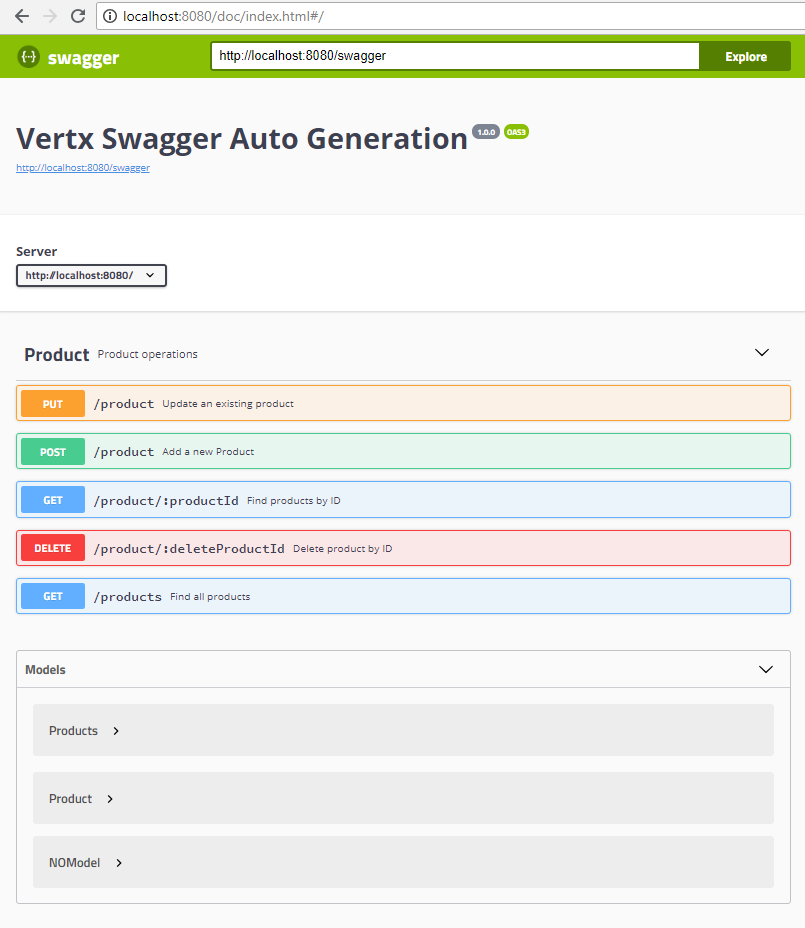

# vertx-auto-swagger

> TL;DR - How to get java Vert.x to automatically generate a Open API v3 spec (A.k.a. Swagger) and serve it to Swagger UI, served through Vert.x.

### Motivation
I needed a way to generate a swagger spec from Java code, instead of having to hand craft a swagger JSON file.

I also wanted to serve out the spec from Vert.x into Swagger UI so that it could be used by all.

There is a more detailed write up available on my blog post: 
http://anupsaund.com/how-to-generate-openapi-3-0-swagger-spec-from-vertx-java-and-serve-it-via-swagger-ui

### What does it do?

1.  Read Java Annotations and map them into a openAPI spec.
2.  Serve the openAPI spec out on an end point.
3.  Serve a distributable version of SwaggerUI which presents the swagger spec from point 2.


### Screenshot of Swagger UI


### What does a typical Java annotation look like?

```java
@Operation(summary = "Find products by ID", method = "GET", operationId = "product/:productId",
    tags = {
      "Product"
    },
    parameters = {
      @Parameter(in = ParameterIn.PATH, name = "productId",
        required = true, description = "The unique ID belonging to the product", schema = @Schema(type = "string"))
    },
    responses = {
      @ApiResponse(responseCode = "200", description = "OK",
        content = @Content(
          mediaType = "application/json",
          encoding = @Encoding(contentType = "application/json"),
          schema = @Schema(name = "product", example =
            "{" +
              "'_id':'abc'," +
              "'title':'Red Truck'," +
              "'image_url':'https://images.pexels.com/photos/1112597/pexels-photo-1112597.jpeg'," +
              "'from_date':'2018-08-30'," +
              "'to_date':'2019-08-30'," +
              "'price':'125.00'," +
              "'enabled':true" +
              "}",
            implementation = Product.class)
        )
      ),
      @ApiResponse(responseCode = "404", description = "Not found."),
      @ApiResponse(responseCode = "500", description = "Internal Server Error.")
    }
  )
```

## How to get it running

> Dependancies: Maven, JAVA and a JAVA IDE is helpful.

1. Clone the repository and use Maven to install dependancies.
1. In Intellij set up a config to run a Java Application with the following settings.

``` 
  Main Class: io.vertx.core.Launcher
  VM Options: <up to you, or leave blank>
  Program Arguments: run io.vertx.VertxAutoSwagger.MainVerticle
```

3. After tha application has launched, go to http://localhost:8080/doc/index.html

#### Special Credit
Goes to Christos Karatzas for creating the generator class which has been used and enhanced for this respository:
 
His original repository is available at: https://github.com/ckaratzas/vertx-openapi-spec-generator

